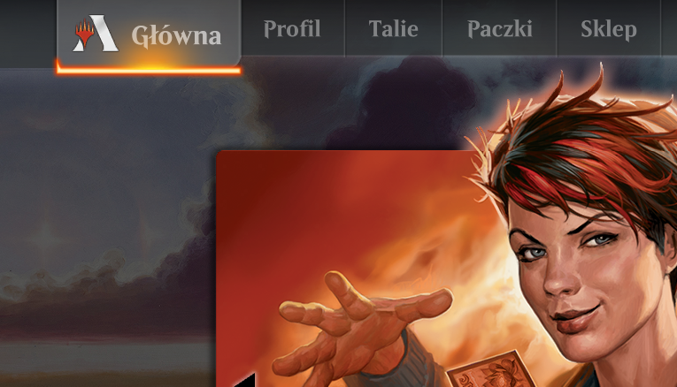

.. include:: progress.rst
.. include:: percentages.inc

***************************************************
 Nieoficjalne tłumaczenie gry Magic: The Gathering
***************************************************

Ninieszy serwis ma na celu pomoc osobom, które chcą zacząć grać
w Magic: the Gathering, ale nie znają angielskiego na tyle dobrze,
by samodzielnie tłumaczyć karty i zasady gry.

Po najechaniu myszką na nazwę karty można zobaczyć jej oryginalny wizerunek.

Jeśli uważasz, że projekt ten jest przydatny, `wesprzyj autora na Patronite <https://patronite.pl/mtgpl>`_.

Spolszczenie Magic Arena
========================

Chcesz grać w Arenę po polsku? :doc:`Tutaj znajdziesz instrukcję<mtgapl>`.

Instrukcja gry
==============

:doc:`Podstawowy podręcznik zasad<rulebook>` |p100|

.. :doc:`Kompletne Zasady<comprules>` (0%)

Tłumaczenie dodatków
====================

Nadchodzące
-----------

* Modern: Modern Horizons 2 (Premiera: 2021-06-11)

Standard
--------

Format posiadający rotację - raz do roku część dodatków przestaje być legalna w tym formacie, by zrobić miejsce na kolejne. Dzięki temu pula kart ma przewidywalny rozmiar.
Jest podzbiorem wszystkich innych formatów.

* :mtgexp:`STX` :doc:`Strixhaven: School of Mages<STX>` |STX_percent|
* :mtgexp:`KHM` :doc:`Kaldheim<KHM>` |KHM_percent|
* :mtgexp:`ZNR` :doc:`Zendikar Rising<ZNR>` |ZNR_percent|
* :mtgexp:`M21` :doc:`Core Set 2021<M21>` |M21_percent|
* :mtgexp:`IKO` :doc:`Ikoria: Lair of Behemots<IKO>` |IKO_percent|
* :mtgexp:`THB` :doc:`Theros: Beyond Death<THB>` |THB_percent|
* :mtgexp:`ELD` :doc:`Throne of Eldraine<ELD>` |ELD_percent|

Pionier
-------

Nowy format bez rotacji. Należą do niego wszystkie dodatki wydane wcześniej w Standardzie od :doc:`Return to Ravnica<RTR>` do teraz. Jest podzbiorem formatu Modern. Na poniższej liście znajdują się dodatki poza Standardem.

* :doc:`Pionier<pioneer>`

Modern
------

Starszy format pozbawiony rotacji. Należą do niego wszystkie dodatki wydane wcześniej w Standardzie od :doc:`Mirrodin<MRD>` do teraz. Na poniższej liście znajdują się dodatki nie wymienione wcześniej.

* :doc:`Pełna lista dodatków wchodzących w skład formatu Modern<modern>`

Oprócz tego format otrzymał specjalny dodatek, który nigdy nie był częścią Standardu:

* :mtgexp:`MH1` :doc:`Modern Horizons<MH1>` |MH1_percent|

Legacy / Vintage
----------------

Formaty Legacy i Vintage zawierają wszystkie karty wydane od początku istnienia
gry. Na poniższej liście znajdują się te dodatki, które nie znalazły się na wcześniejszych listach.

* :doc:`Lista dodatków<legacy>`

Pozostałe produkty
==================

Jumpstart
---------

Jumpstart jest ciekawym sposobem na szybką grę w MTG. Dodatek zwiera niemal 500 przedruków z innych dodatków. Oprócz tego zawiera 37 nowych kart legalnych tylko w formatach Eternal (Legacy, Vintage, Commander). Karty z symbolem :mtgexp:`M21` są legalne w Standardzie 2021.

* :mtgexp:`JMP` :doc:`Jumpstart<JMP>` |JMP_percent|

Zestawy gildyjne
----------------

* :mtgexp:`azorius` :mtgexp:`gruul` :mtgexp:`rakdos` :mtgexp:`simic` :mtgexp:`orzhov` :doc:`Ravnica Allegiance Kits<GK2>` |GK2_percent|
* :mtgexp:`dimir` :mtgexp:`selesnya` :mtgexp:`izzet` :mtgexp:`boros` :mtgexp:`golgari` :doc:`Guilds of Ravnica Kits<GK1>` |GK1_percent|

Seria 'Masters'
---------------

* :mtgexp:`TSR` :doc:`Time Spiral Remastered<TSR>` |TSR_percent|
* :mtgexp:`2XM` :doc:`Double Masters<2XM>` |2XM_percent|
* :mtgexp:`UMA` :doc:`Ultimate Masters<UMA>` 2018 |UMA_percent|
* :mtgexp:`A25` :doc:`Masters 25<A25>` 2018 |A25_percent|
* :mtgexp:`IMA` :doc:`Iconic Masters<IMA>` 2017 |IMA_percent|
* :mtgexp:`MM3` :doc:`Modern Masters 2017<MM3>` |MM3_percent|
* :mtgexp:`EMA` :doc:`Eternal Masters<EMA>` 2016 |EMA_percent|
* :mtgexp:`MM2` :doc:`Modern Masters 2015<MM2>` |MM2_percent|
* :mtgexp:`MMA` :doc:`Modern Masters<MMA>` 2013 |MMA_percent|

Commander i pokrewne
--------------------

:doc:`Zasady formatu Commander (Dowódca)<commander>` |p25|

* :mtgexp:`C21` :doc:`Commander 2021<C21>` |C21_percent|
* :mtgexp:`KHC` :doc:`Kaldheim Commander Decks<KHC>` |KHC_percent|
* :mtgexp:`CMR` :doc:`Commander Legends<CMR>` |CMR_percent|
* :mtgexp:`ZNC` :doc:`Zendikar Rising Commander Decks<ZNC>` |ZNC_percent|
* :mtgexp:`C20` :doc:`Commander 2020<C20>` |C20_percent|
* :mtgexp:`C19` :doc:`Commander 2019<C19>` |C19_percent|
* :mtgexp:`C18` :doc:`Commander 2018<C18>` |C18_percent|
* :mtgexp:`BBD` :doc:`Battlebond<BBD>` |BBD_percent|
* :mtgexp:`C17` :doc:`Commander 2017<C17>` |C17_percent|
* :mtgexp:`C16` :doc:`Commander 2016<C16>` |C16_percent|
* :mtgexp:`C15` :doc:`Commander 2015<C15>` |C15_percent|
* :mtgexp:`C14` :doc:`Commander 2014<C14>` |C14_percent|
* :mtgexp:`C13` :doc:`Commander 2013<C13>` |C13_percent|
* :mtgexp:`CM1` :doc:`Commander's Arsenal<C13>` |CM1_percent|
* :mtgexp:`CMD` :doc:`Commander<CMD>` |CMD_percent|

Conspiracy
----------

* :mtgexp:`CN2` :doc:`Conspiracy: Take the Crown<CN2>` |CN2_percent|
* :mtgexp:`CNS` :doc:`Conspiracy<CNS>` |CNS_percent|

Pozostałe produkty
==================

* :mtgexp:`GNT` :doc:`Game Night<GNT>` |GNT_percent|
* :mtgexp:`E02` :doc:`Explorers of Ixalan<E02>` |E02_percent|

Poniższe produkty nie zawierają zwykłych kart do Magica, ale umożliwiają specjalne rodzaje rozgrywek.

* :mtgexp:`MTG` :doc:`Bohaterowie<THS_heroes>` |p100|
* :mtgexp:`JOU` :doc:`Pokonaj Bóstwo<JOU_god>` |p100|
* :mtgexp:`BNG` :doc:`Walka z Hordą<BNG_horde>` |p100|
* :mtgexp:`THS` :doc:`Staw czoła Hydrze<THS_hydra>` |p100|

Warto przeczytać
================

* :doc:`Uzasadnienie tłumaczeń<rationale>`
* :doc:`Nowe sposoby gry<game_variants>`
* :doc:`Format Handicap<handicap>`
* :doc:`Polskie lądy i żetony<polish_cards>`

Glosariusz
==========

* :doc:`Słowniczek podstawowych pojęć oraz slangu<glossary>`

Ostatnie zmiany
===============
Proszę zajrzeć do pliku :doc:`Ostatnie zmiany<changelog>`

Sponsorzy
=========

* `Centrum hobbystyczne "Strefa" <https://strefamarzen.pl/>`_ z Bielska-Białej.
* `Wspierający poprzez Patronite <https://patronite.pl/mtgpl>`_.

Ekipa
=====

Niniejsze tłumaczenie powstało dzięki pracy następujących osób:

* Dominik Kozaczko - pomysłodawca, główny tłumacz
* Bartek Pękala - tłumacz
* Krzysztof Buniewicz - tłumacz
* Zofia Wąchocka - tłumacz, filolog
* Roman Cupek - nadzorca merytoryczny

Kwestie prawne
==============

* Niniejszy serwis działa zgodnie z zasadami zawartymi w dokumencie
  `Wizards of the Coast's Fan Content Policy <https://company.wizards.com/fancontentpolicy>`_.
* Część materiałów w tym serwisie jest własnością Wizards of the Coast. ©Wizards of the Coast LLC.
* Zawartość niniejszego serwisu NIE JEST zatwierdzona lub sponsorowana przez Wizards of the Coast LLC.
* Tłumaczenia zawarte w tym serwisie (CC) copyleft Dominik Kozaczko. Some rights reversed.
* Licencja tłumaczeń: `CC BY-NC-SA 4.0 <https://creativecommons.org/licenses/by-nc-sa/4.0/legalcode.pl>`_

Legal notice
------------

* MTGpoPolsku.pl is unofficial Fan Content permitted under the `Fan Content Policy <https://company.wizards.com/fancontentpolicy>`_. Not approved/endorsed by Wizards. Portions of the materials used are property of Wizards of the Coast. ©Wizards of the Coast LLC.
* Translation work `(CC) copyleft <https://creativecommons.org/licenses/by-nc-sa/4.0/legalcode>`_ Dominik Kozaczko. Some rights reversed.

.. toctree::
   :hidden:

   rulebook
   pioneer
   modern
   legacy
   commander
   commander_banned
   game_variants
   handicap
   rationale
   polish_cards
   glossary
   changelog
   full_toctree
