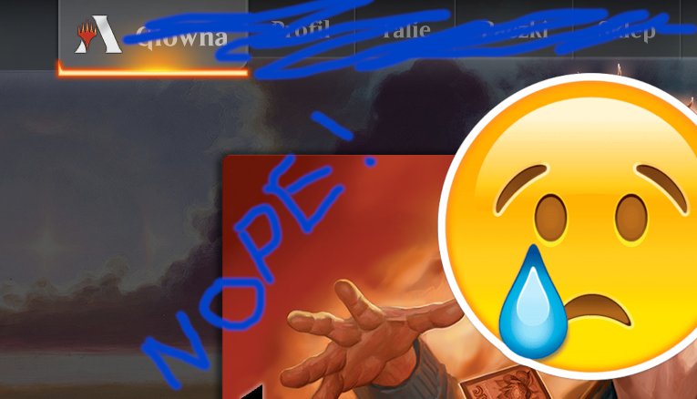
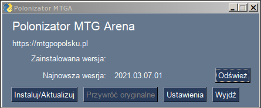

Spolszczenie do gry Magic Arena
===============================

W chwili obecnej projekt został zawieszony. Najnowsza wersja Areny całkowicie uniemożliwia wgrywanie spolszczenia.

Jeśli uważasz, że spolszczenie było przydatne,
`możesz zagłosować na prośbę o ponowne umożliwienie dodawania własnych tłumaczeń <https://feedback.wizards.com/forums/918667-mtg-arena-bugs-product-suggestions/suggestions/44158059-please-add-and-document-it-somewhere-possibility>`_.

Poprzednia treść strony
=======================

Kilka uwag na sam początek:

* Każda aktualizacja Areny nadpisuje część plików (najczęściej wszystkie). Wgranie tłumaczenia starej wersji może spowodować zawieszenie gry, więc proszę czekać na wydanie aktualizacji tłumaczenia. Zwykle publikowane jest w przeciągu 24 godzin. Pracuję nad metodą zabezpieczającą przed wgraniem plików do złej wersji gry.
* Niektóre karty mogą jeszcze nie być przetłumaczone. To samo dotyczy komunikatów w grze. Tłumaczenie ciągle postępuje, więc z czasem braków będzie coraz mniej.
* Mimo najlepszych chęci może się okazać, że niektóre tłumaczenia są błędne. Proszę nie mieć pretensji, nie dajemy żadnej gwarancji poprawności tłumaczenia. Istotne turnieje najlepiej grać używając oficjalnie wspieranego języka, by nie było wątpliwości odnośnie tekstów kart.
* Zachęcamy do `wsparcia projektu na Patronite <https://patronite.pl/mtgpl>`_ :)

Program instalujący spolszczenie
--------------------------------

Jeśli wcześniej instalowano spolszczenie ręcznie, to teraz jest ostatni moment, żeby przywrócić pliki do pierwotnej postaci.

1. Wejdź na `stronę, gdzie publikuję program spolszczający <https://github.com/dekoza/mtga_polonize/releases>`_.
2. Zobaczysz listę wydań. Najnowsze jest na samej górze.
3. Na dole danego wydania jest sekcja Assets, rozwiń ją.
4. Pobierz plik ``polonizator.exe``.
5. Uruchom polonizator.
6. Przy pierwszym uruchomieniu Windows zwróci uwagę, że kod nie jest podpisany i czy na pewno chcesz program uruchomić. Możesz też dostać komunikat od antywirusa, że wykonuje on skanowanie pliku. To normalne. Nie powinien wykryć zagrożeń. Program budowany jest na sterylnym systemie (Linux).
7. Jeśli program poprosi o podanie ścieżki do Areny, to znaczy, że Twoja Arena jest w innym miejscu niż standardowe ``C:\Program Files\Wizards of the Coast\MTGA\`` - podaj zatem prawidłową lokalizację.
8. Program sprawdza zainstalowaną wersję tłumaczenia (dopiero od wersji 2021.03.07.01) oraz najnowszą dostępną do pobrania.
9. Kliknij "Instaluj/Aktualizuj".
10. Uruchom Arenę. UWAGA - podczas pierwszego uruchomienia po instalacji, Arena robi jakąś analizę/reindeksację plików. Skutkuje to
    czarnym ekranem przez kilkadziesiąt sekund (tzw. dłuższa chwila). Cierpliwości! Po uruchomieniu wejdź do opcji -> Graphics -> rozwiń listę języków. W miejscu portugalskiego i francuskiego powinny być "Polski" i "PL+EN DEBUG" - ta druga opcja jest dla pomocników.

W razie awarii programu lub nie działania spolszczenia, proszę o `zgłoszenie błędu poprzez formularz w repozytorium programu <https://github.com/dekoza/mtga_polonize/issues>`_ (wymaga rejestracji) i załączenie pliku ``polonizator.log``

Wszelkie błędy w tłumaczniu (literówki, ortograficzne, językowe itd.) proszę zgłaszać poprzez `formularz w repozytorium projektu <https://github.com/dekoza/mtgpl/issues>`_ (wymaga rejestracji).

Ręczna instalacja tłumaczenia
-----------------------------

Jeśli program instalujący spolszczenie z jakiegoś powodu nie działa, zawsze można zainstalować spolszczenie ręcznie:

1. Wejdź na `stronę, gdzie publikuję wydania <https://github.com/dekoza/mtgpl/releases/>`_.
2. Na samej górze jest najnowsza wersja. Dla ułatwienia dodaję do tytułu datę wydania.
3. Na samym dole danego wydania jest sekcja Assets, rozwiń ją.
4. Pobierz plik, którego nazwa zaczyna się od ``MTGA_DATA`` - tam są pliki używane przez grę.
5. Znajdź katalog instalacji gry na swoim komputerze. Domyślnie powinien to być ``C:\Program Files\Wizards of the Coast\MTGA\``
6. Wewnątrz znajduje się katalog ``MTGA_Data``. Skopiuj znajdujące się w nim katalogi ``Data`` oraz ``Loc`` w jakieś bezpieczne miejsce. Niczego nie przenoś ani nie kasuj! Nie wszystkie pliki zostaną podmienione i reszta ma zostać!
7. Rozpakuj pobrane archiwum. Jego struktura odzwierciedla zawartość powyższego katalogu ``MTGA_Data`` - przekopiuj pliki w odpowiednie miejsca nadpisując oryginalne plilki.
8. Uruchom grę. Wejdź do opcji (trybik na górze po prawej), wybierz Graphic. Rozwiń listę opcji "Locale" - w miejscu portugalskiego powinna być opcja ``Polski + English``,
   a w miejscu francuskiego – ``Pl + En (DEBUG)``. Pierwsza opcja jest dla normalnych graczy. Teksty, które nie zostały jeszcze przetłumaczone na polski będą się wyświetlać po angielsku
   (za wyjątkiem pierwszych kilku komunikatów tuż po uruchomieniu gry, których z jakichś powodów nie da się przetłumaczyć). Druga opcja jest przeznaczona dla osób chcących pomóc
   przy tłumaczeniu programu. Nieprzetłumaczone teksty są tam zastąpione identyfikatorami pozwalającymi szybko znaleźć dany tekst w plikach językowych.
9. Tak, polskie znaki wyglądają dziwnie, ale SĄ! Jeszcze niedawno konieczne było wycinanie ogonków, bo inaczej nie byłyby wyświetlane i zamiast "ląd" był "lad" ;)
10. Miłej zabawy!

Sprawdzaj co jakiś czas stronę z punktu 1 - proces tłumaczenia będzie trwał dopóki wszystko nie zostanie przetłumaczone. Możesz więc spodziewać się
regularnych aktualizacji.

Przygotowuję program, który sam wykona wszystkie powyższe operacje, ale to jeszcze trochę potrwa - cierpliwości!

PS.
Mobilna wersja gry korzysta z tej samej struktury plików. Może się zatem okazać, że te same pliki zadziałają po przekopiowaniu ich na urządzenie mobilne.
Tak czy inaczej ta opcja też jest na tapecie i wkrótce pojawi się szczegółowa instrukcja spolszczenia wersji mobilnej.
