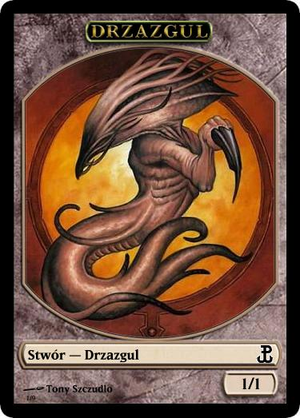

.. polish tokens

===============
 Polskie karty
===============

Wszystkie karty zostały przygotowane w programie `Magic Set Editor`_.

Lądy
----

Żetony
------

Bestia (Beast)
    Pojawia się w znacznej części dodatków, ostatnio w Magic 2013.
    
    |image_beast_1|

Ptak (Bird) Niebieski
    Pojawił się w dodatku :doc:`Theros<THS>`.
    
    |image_bird_1|

Ptak (Bird) Biały
    Pojawia się w sporej części dodatków, ostatnio w bloku :doc:`Return to Ravnica<RTR>`.
    
    |image_bird_2| |image_bird_3|

Rycerz (Knight)
    Obecny w bloku :doc:`Return to Ravnica<RTR>`

    |image_knight_1| |image_knight_2| |image_knight_3| |image_knight_4|

Drzazgul (Sliver)
    Obecny w podstawce :doc:`Magic 2014<M14>`.
    
    |image_sliver|

Piechur (Soldier) Biały
    Obecny niemal w każdym bloku.

    |image_soldier_2| |image_soldier_4|

Piechur (Soldier) Czerwony
    Ostatnio pojawił się w bloku :doc:`Theros<THS>`
    
    |image_soldier_3|
    
Piechur (Soldier) Czerwono-Biały
    Ostatnio pojawił się w bloku :doc:`Return to Ravnica<RTR>`

    |image_soldier_1|

Wilk (Wolf)
    Pojawia się w sporej części dodatków, ostatnio w Magic 2013.
    
    |image_wolf_1|

.. _Magic Set Editor: http://magicseteditor.sourceforge.net/

.. |image_beast_1| image:: images/tokens/beast_1.jpg

.. |image_bird_1| image:: images/tokens/bird_1.jpg
.. |image_bird_2| image:: images/tokens/bird_2.jpg
.. |image_bird_3| image:: images/tokens/bird_3.jpg

.. |image_knight_1| image:: images/tokens/knight_1.png
.. |image_knight_2| image:: images/tokens/knight_2.png
.. |image_knight_3| image:: images/tokens/knight_3.png
.. |image_knight_4| image:: images/tokens/knight_4.png

.. |image_soldier_1| image:: images/tokens/soldier_1.jpg
.. |image_soldier_2| image:: images/tokens/soldier_2.jpg
.. |image_soldier_3| image:: images/tokens/soldier_3.jpg
.. |image_soldier_4| image:: images/tokens/soldier_4.jpg

.. |image_wolf_1| image:: images/tokens/wolf_1.jpg
