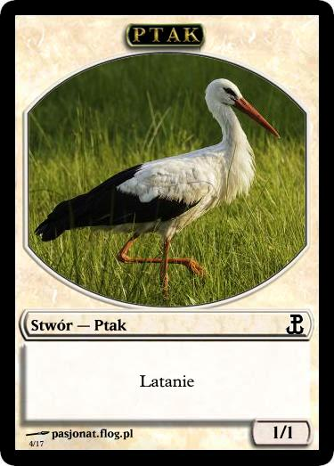

.. polish cards

===============
 Polskie karty
===============

Wszystkie karty zostały przygotowane w programie `Magic Set Editor`_.

Lądy
----

Las (Forest)
    |image_forest_1|

Wyspa (Island)
    |image_island_1|

Góra (Mountain)
    |image_mountain_1| |image_mountain_2|

Równina (Plains)
    |image_plains_1| |image_plains_2| |image_plains_3|

Bagno (Swamp)
    |image_swamp_1| |image_swamp_2| 

.. |image_forest_1| image:: images/lands/forest_1.png
.. |image_forest_2| image:: images/lands/forest_2.png

.. |image_mountain_2| image:: images/lands/mountain_2.png

.. |image_plains_1| image:: images/lands/plains_1.png

.. |image_plains_3| image:: images/lands/plains_3.png

.. |image_swamp_2| image:: images/lands/swamp_2.png

Żetony
------

Bestia (Beast)
    Pojawia się w znacznej części dodatków, ostatnio w Magic 2013.
    
    |image_beast_1| |image_beast_2| |image_beast_3|

Ptak (Bird) Niebieski
    Pojawił się w dodatku :doc:`Theros<THS>`.
    
    |image_bird_1|

Ptak (Bird) Biały
    Pojawia się w sporej części dodatków, ostatnio w bloku :doc:`Return to Ravnica<RTR>`.
    
    |image_bird_2| |image_bird_3|

Knur (Boar)
    Pojawił się w dodatku :doc:`Theros<THS>`.
    
    |image_boar_1|

Rycerz (Knight)
    Obecny w bloku :doc:`Return to Ravnica<RTR>`

    |image_knight_1| |image_knight_2| |image_knight_3| |image_knight_4|

Drzazgul (Sliver)
    Obecny w podstawce :doc:`Magic 2014<M14>`.
    
    |image_sliver_1|

Piechur (Soldier) Biały
    Obecny niemal w każdym bloku.

    |image_soldier_2| |image_soldier_4|

Piechur (Soldier) Czerwony
    Ostatnio pojawił się w bloku :doc:`Theros<THS>`
    
    |image_soldier_3|
    
Piechur (Soldier) Czerwono-Biały
    Ostatnio pojawił się w bloku :doc:`Return to Ravnica<RTR>`

    |image_soldier_1|

Wilk (Wolf)
    Pojawia się w sporej części dodatków, ostatnio w Magic 2013.
    
    |image_wolf_1|

.. _Magic Set Editor: http://magicseteditor.sourceforge.net/

.. |image_sliver_1| image:: images/tokens/sliver_1.jpg

.. |image_beast_1| image:: images/tokens/beast_1.jpg
.. |image_beast_2| image:: images/tokens/beast_2.jpg

.. |image_bird_1| image:: images/tokens/bird_1.jpg

.. |image_bird_3| image:: images/tokens/bird_3.jpg

.. |image_knight_1| image:: images/tokens/knight_1.png

.. |image_knight_3| image:: images/tokens/knight_3.png
.. |image_knight_4| image:: images/tokens/knight_4.png

.. |image_soldier_1| image:: images/tokens/soldier_1.jpg

.. |image_wolf_1| image:: images/tokens/wolf_1.jpg

