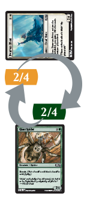
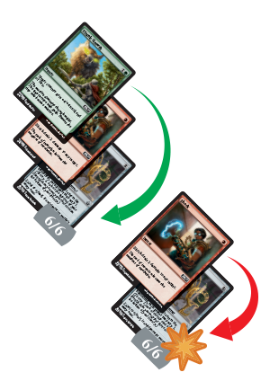

.. Magic The Gathering Basc Rulebook by Wizards of the Coast
   Converting to reStructuredText and editing: Dominik Kozaczko <dominik@kozaczko.info>
.. include:: symbols.rst

**************************************
 Magic the Gathering - Basic Rulebook
**************************************

Magic Gameplay
--------------

If you are new to Magic, this section will provide an introduction to
the game and a rulebook to refer to when you have questions.

**BASIC TOPICS**

#. :ref:`Parts of a Card<sec-parts-of-a-card>`
#. :ref:`Your Play Area<sec-your-play-area>`
#. :ref:`Game Actions<sec-game-actions>`

**ADVANCED TOPICS**

#. :ref:`Targeting<sec-targeting>`
#. :ref:`The Stack<sec-the-stack>`
#. :ref:`Parts of the Turn<sec-parts-of-the-turn>`

.. _sec-parts-of-a-card:

How to Read a *Magic* Card
--------------------------

*Magic* cards are formatted so that the information you need to know is
always in the same place.

 

 
.. _card-name:

NAME
~~~~

Each card has a name that serves as its unique identifier. Though a card
may be reprinted in many *Magic* sets, no two cards with the same name
will ever function differently. In most *Magic* formats, you can have up
to four copies of a card with the same name (except basic lands, which
are unlimited). When a card’s name appears in its text box, the card is
referring only to itself, not to any other cards with the same name.

.. _card-mana-cost:

MANA COST
~~~~~~~~~

Mana is the resource used to cast spells in *Magic*. All spell cards
have a mana cost in the upper right corner. Serra Angel’s mana cost,
|mana_3|\ |mana_w|\ |mana_w|, means that you must pay three mana of any
kind plus two white mana to cast it.

.. _card-type-line:

TYPE LINE
~~~~~~~~~

Every card in *Magic* has a type, and some cards also have subtypes or
supertypes that provide more information. For example, Serra Angel’s
type is creature, and its subtype is Angel.

| **Lands**
| You’ll use lands to generate mana, the game’s primary resource, which
  is used to cast spells and activate abilities. Each basic land makes
  one mana of a particular color. Plains make white mana |mana_w|,
  Islands make blue mana |mana_u|, Swamps make black mana |mana_b|,
  Mountains make red mana |mana_r|, and Forests make green mana
  |mana_g|.

You can play one land during each of your turns. To play a land, just
put it from your hand onto the battlefield during either of the main
phases of your turn.

| **Creatures**
| Creatures fight for you: they can attack during the combat phase of
  your turn and block during the combat phase of an opponent’s turn. You
  can cast a creature as a spell during your main phase, and it remains
  on the battlefield as a permanent. Creatures enter the battlefield
  with "summoning sickness," which means that a creature you control
  can’t attack (or use an ability that has |tap| in its cost) until
  it starts your turn under your control. You can block with a creature
  no matter how long it’s been on the battlefield.

| **Artifacts**
| Artifacts represent machines or magical objects. Like creatures, you
  can cast an artifact as a spell during your main phase, and it remains
  on the battlefield unless it’s destroyed, sacrificed, exiled, or
  otherwise removed. Most artifacts are colorless, which means you can
  cast them with any color of mana.

| **Enchantments**
| Enchantments have persistent magical effects that affect the game as
  long as they’re on the battlefield. Like creatures, you can cast an
  enchantment as a spell during your main phase, and it remains on the
  battlefield unless it’s destroyed, sacrificed, exiled, or otherwise
  removed.

| **Sorceries**
| Sorceries are spells that you can cast only during a main phase of
  your turn. They have a one-time effect. You do what the spell says,
  and then put the card into your graveyard.

| **Instants**
| Instants are spells that can be cast at any time, even during your
  opponent’s turn or during combat. Like sorceries, instants have a
  one-time effect, and then you put them into your graveyard.

.. _card-text-box:

TEXT BOX
~~~~~~~~

Some cards have special abilities that are printed here (in the area
above the dividing line), and abilities sometimes have reminder text in
parentheses to help explain what they do. Flavor text may also appear in
the text box, usually below a divider bar. Flavor text has no effect on
gameplay; it’s a bit of story information about the card.

Abilities of creatures and other permanents on the battlefield usually
fall into one of three categories: static abilities, triggered
abilities, and activated abilities.

| **Static Abilities**
| A static ability is text that’s always true while that card is on the
  battlefield. For example, Favorable Winds is an enchantment with the
  static ability "Creatures you control with flying get +1/+1." You
  don’t have to activate a static ability; it just does what it says.

| **Triggered Abilities**
| A triggered ability is an ability that is triggered by a specific
  event occurring in the game. For example, Tattered Mummy is a creature
  with the triggered ability "When Tattered Mummy dies, each opponent
  loses 2 life." Each triggered ability starts with the word "when,"
  "whenever," or "at." You don’t activate a triggered ability— it
  automatically triggers whenever the condition or conditions stated in
  the first part of the ability are met.

| **Activated Abilities**
| An activated ability is an ability that you can activate whenever you
  want (like casting an instant), as long as you can pay the cost. Each
  activated ability is formatted in the same way: "Cost: Effect." For
  example, Inspired Sphinx is a creature with the activated ability
  "|mana_3|\ |mana_u|: Create a 1/1 colorless Thopter artifact
  creature token with flying." Some activated abilities contain the
  |tap| (tap) symbol in their costs; this means that you must tap
  that card to activate the ability. You can’t activate this kind of
  ability if the permanent is already tapped or if it’s a creature with
  summoning sickness.

.. _card-power-toughness:

POWER/TOUGHNESS
~~~~~~~~~~~~~~~

Every creature card has a box in the lower right corner that shows its
power and toughness. A creature’s power (the first number) is the amount
of damage it deals in combat. Its toughness (the second number) is the
amount of damage that must be dealt to it in a single turn to destroy
it.

 

.. _card-expansion-symbol:

EXPANSION SYMBOL
~~~~~~~~~~~~~~~~

This symbol tells you which *Magic* set the card is from. Each *Magic*
set has its own distinct symbol, and the color of the symbol tells you
the card’s rarity.

 

|image14|\ |image15|\ |image16|\ |image17|

.. _sec-your-play-area:

YOUR PLAY AREA
--------------

 

.. image:: images/playarea.png
   :align: center

 

A game of Magic starts with only players’ decks and life counters on the
table, but once each player has had a few turns to play lands, cast
spells, and attack with creatures, a kind of virtual gameboard begins to
take shape. That gameboard is divided into several different game zones.
The previous page shows what a two-player game might look like after a
few turns.

.. _zone-library:

LIBRARY
~~~~~~~

Your library is your draw pile, which remains face down throughout the
game. You lose the game if you are forced to draw a card but cannot
because your library is out of cards.

.. _zone-hand:

HAND
~~~~

You start the game by drawing a hand of seven cards. If you have more
than seven cards in your hand as your turn ends, you must discard down
to seven.

.. _zone-battlefield:

BATTLEFIELD
~~~~~~~~~~~

You and your opponents share the battlefield. Cards that go onto the
battlefield (including lands, creatures, artifacts, and enchantments)
are called permanents. Instants and sorceries are never on the
battlefield. You can arrange your permanents however you want (we
recommend putting your lands closest to you), but your opponent must be
able to see all of them.

.. _zone-graveyard:

GRAVEYARD
~~~~~~~~~

Your graveyard is your discard pile: creatures that die, artifacts and
enchantments that are destroyed, and cards you discard from your hand go
here. The cards in your graveyard should always be face up, and anyone
can look at them at any time. Each player has their own graveyard.

.. _zone-exile:

EXILE
~~~~~

If a spell or ability exiles a card, that card is set apart from the
rest of the game. Cards in exile are normally face up.

.. _sec-game-actions:

Game Actions
------------

This section describes the actions that you’ll take during a game,
including tapping your cards, casting spells, and attacking and blocking
with creatures in combat.

.. _actions-tapping-untappings:

TAPPING AND UNTAPPING
~~~~~~~~~~~~~~~~~~~~~

To tap a card is to turn it sideways to show that it has been used for
the turn. You do this when you use a land to make mana, when you attack
with a creature, or when you activate an ability that has the |tap|
symbol as part of its cost (|tap| means "tap this permanent"). When
a permanent is tapped, you can’t tap it again until it’s been untapped
(turned back upright). As your turn begins, untap your tapped cards so
you can use them again.

.. _actions-casting-spells:

CASTING SPELLS
~~~~~~~~~~~~~~

To cast a spell, you must pay its mana cost (located in the upper right
corner of the card) by tapping lands (or other permanents) to make the
amount and Game Actions type of mana which that spell requires. For
example, if you were casting Serra Angel, which costs
|mana_3|\ |mana_w|\ |mana_w|, you could tap three basic lands of any
type to pay |mana_3| plus two Plains to pay |mana_w|\ |mana_w|.

Once a spell has been cast, one of two things happens. If the spell is
an instant or a sorcery, you follow the instructions on the card, and
then you put the card into your graveyard. If the spell is a creature,
artifact, or enchantment, you put the card on the table in front of you.
The card is now on the battlefield.

Cards on the battlefield are called permanents to differentiate them
from instants and sorceries, which are never on the battlefield.

 

.. image:: images/castingex.png
   :align: center

 
.. _actions-attacking-blocking:

ATTACKING AND BLOCKING
~~~~~~~~~~~~~~~~~~~~~~

The most common way to win the game is to attack with your creatures. If
a creature that is attacking an opponent isn’t blocked, it deals damage
equal to its power to that opponent.

The middle phase of each turn is the combat phase. In your combat phase,
you choose which of your creatures will attack, and you choose which
opponents they will attack. Tap your creatures to show that they are
attacking. Your opponents then choose which of their creatures will
block, if any. Tapped creatures can’t be declared as blockers.

Once all blockers have been chosen, each creature—both attackers and
blockers—simultaneously deals damage equal to its power (the number on
the left side of the slash in the lower right corner of the card).

-  An attacking creature that isn’t blocked deals damage to the player
   it’s attacking.
-  An attacking creature that is blocked deals damage to the creature or
   creatures that are blocking it, and vice versa.

If damage is dealt to your opponent, they lose that much life.

If one of your attacking creatures is blocked by multiple creatures, you
decide how to divide its combat damage among them. You must assign at
least enough damage to the first blocking creature to destroy it before
you can assign damage to the second one, and so on.

If a creature is dealt damage equal to or greater than its toughness
over the course of a single turn (whether it be combat damage, damage
from spells or abilities, or a combination of both), that creature is
destroyed, and it goes to its owner’s graveyard (or "dies"). If a
creature takes damage that isn’t enough to destroy it in a single turn,
that creature stays on the battlefield, and the damage wears off at the
end of the turn.

.. _actions-examples:

In the following examples, an opponent is attacking you with a variety of creatures:
~~~~~~~~~~~~~~~~~~~~~~~~~~~~~~~~~~~~~~~~~~~~~~~~~~~~~~~~~~~~~~~~~~~~~~~~~~~~~~~~~~~~

.. figure:: images/unblocked.png
   :align: center

   Mesa Unicorn deals 2 damage to you.

.. figure:: images/attackerdead.png
   :align: center
   
   Mesa Unicorn is destroyed.

   
   Both creatures survive.

.. figure:: images/defenderdead.png
   :align: center
   
   Giant Spider is destroyed.

 

In this example, Dwarven Priest is attacking, and you have two creatures
that can block. When you block one attacker with two or more creatures,
your opponent must choose the order in which your blockers will take
damage. Remember, the attacking player always chooses the order in which
blocking creatures receive damage.

 

Reclamation Sage and Giant Spider will deal a total of 4 damage to
Dwarven Priest, which is enough to destroy it. Meanwhile, Dwarven Priest
can deal enough damage to destroy Reclamation Sage, but not enough to
destroy Giant Spider. Since your opponent’s Dwarven Priest will be
destroyed in either case, they order Reclamation Sage before Giant
Spider so that at least one of your creatures will be destroyed.

 
.. image:: images/doubleblock.png
   :align: center

 

Once blockers have been ordered, damage is dealt. Dwarven Priest deals 1
damage to Reclamation Sage, destroying it, then deals its remaining 1
damage to Giant Spider.

.. _sec-advanced:

Advanced Topics
---------------

One of the most fun and interesting aspects of the *Magic* game is the
tremendous number of unique cards you can play with, which in turn
provide an incredibly wide range of things that could happen in any
given game. This section is a reference for when you need to know more
details about the rules of *Magic*.

.. _sec-targeting:

TARGETING
---------

Some spells and abilities use the word "target" to describe something
that the spell or ability will affect. You must choose all targets for a
spell when you cast it, and for an ability when it triggers or when you
activate it. If you can’t meet the targeting requirements, you can’t
cast the spell or use the ability. For example, if a spell has the text
"Destroy target creature," but there are no creatures on the
battlefield, you can’t cast that spell because it has no valid targets.

If a spell "deals damage to any target," you can choose any creature or
player (or planeswalker, if a player has one) as a target for that
spell.

Once you choose targets, you can’t change your mind later. When the
spell or ability resolves, it checks the targets to make sure they’re
still legal (that is, they’re still there and they still match the
requirements of the spell or ability). If a target isn’t legal, the
spell or ability can’t affect it. If none of the targets are legal, the
spell or ability does nothing at all.

.. _sec-the-stack:

THE STACK
---------

The stack is a game zone shared by all players (like the battlefield)
where spells and abilities wait to resolve. Resolving a spell or ability
simply means that its effect happens.

| **Using the Stack**
| When you cast a spell or activate an ability, it doesn’t resolve right
  away—it goes on the stack. Spells and abilities remain on the stack
  until both players choose not to cast any new spells or activate any
  new abilities. Triggered abilities also go on the stack until they
  resolve.

When you have finished putting spells and abilities on the stack,
priority then passes to the next player in turn order, who may want to
use a spell or ability of their own in response. Subsequent players
(including you) can then respond to that player’s response, and so
on—the result is a "stack" waiting to resolve. Spells and abilities
remain on the stack until all players choose not to cast any new spells
or activate any new abilities.

*A general rule is that spells and abilities on the stack resolve one by
one, beginning with the last one put on the stack.*

| **Responding to Spells and Abilities**
| When you cast a spell or activate an ability, it doesn’t resolve right
  away—it goes on the stack. Spells and abilities remain on the stack
  until both players choose not to cast any new spells or activate any
  new abilities. Triggered abilities also go on the stack until they
  resolve.

Each player has an opportunity to cast an instant spell (or activate an
activated ability) in response to any spell or ability that goes on the
stack. If a player does decide to respond, their spell or ability goes
on the stack on top of what was already waiting there. When all players
pass—that is, decline to do anything more—the top spell or ability on
the stack will resolve.

 

.. image:: images/stackimg.png
   :align: center

 

After a spell or ability resolves, both players again get the chance to
respond. If no one does, the next thing waiting on the stack will
resolve. If the stack is empty, the current step of the turn will end,
and the game will proceed to the next step.

| **Example of Spells on the Stack**
| Your opponent casts Shock targeting your Eager Construct, a 2/2
  creature. Shock goes on the stack. You respond to Shock by casting
  Titanic Growth. Titanic Growth goes on the stack on top of Shock. You
  and your opponent both decline to do anything else.

Titanic Growth resolves, making Eager Construct a 6/6 until the end of
the turn. Then Shock resolves and deals 2 damage to the pumped-up Eager
Construct, which is not enough to destroy it.

 

 

| **What would happen if Titanic Growth were cast first?**
| The Shock would go on the stack on top of Titanic Growth, which means
  it would resolve first this time. Shock would still deal 2 damage to
  Eager Construct, but this time that damage is being dealt before
  Titanic Growth can resolve and take effect—so 2 damage is enough to
  destroy Eager Construct!

 

.. image:: images/stackex2.png
   :align: center

.. _sec-parts-of-the-turn:

Parts of the Turn
-----------------

Each turn proceeds in the same sequence. Whenever you enter a new step
or phase, any triggered abilities that happen during that step or phase
trigger and are put on the stack. The active player (the player whose
turn it is) gets to start casting spells and activating abilities, then
each other player in turn order will too. When all players decline to do
anything more and nothing is on the stack waiting to resolve, the game
will move to the next step.

 
.. image:: images/yourturn.png
   :align: center

.. _turn-beginning:

BEGINNING PHASE
~~~~~~~~~~~~~~~

-  **Untap step**
   You untap all your tapped permanents. On the first turn of the game,
   you don’t have any permanents, so you just skip this step. No one can
   cast spells or activate abilities during this step.
-  **Upkeep step**
   Players can cast instants and activate abilities. This part of the
   turn is mentioned on a number of cards. If something is supposed to
   happen just once per turn, right at the beginning, an ability will
   trigger "at the beginning of your upkeep."
-  **Draw step**
   You must draw a card from your library (even if you don’t want to).
   The player who goes first in a two-player game skips the draw step on
   their first turn to make up for the advantage of going first. Players
   can then cast instants and activate abilities.

.. _turn-main1:

FIRST MAIN PHASE
~~~~~~~~~~~~~~~~

-  You can cast any number of sorceries, instants, creatures, artifacts,
   enchantments, and planeswalkers, and you can activate abilities. You
   can play a land during this phase, but remember that you can play
   only one land during your turn. Your opponent can cast instants and
   activate abilities.

.. _turn-combat:

COMBAT PHASE
~~~~~~~~~~~~

-  **Beginning of combat step**
   Players can cast instants and activate abilities.
-  **Declare attackers step**
   You decide which, if any, of your untapped creatures will attack, and
   which player or planeswalker they will attack. This taps the
   attacking creatures. Players can then cast instants and activate
   abilities.
-  **Declare blockers step**
   Your opponent decides which, if any, of their untapped creatures will
   block your attacking creatures. If multiple creatures block a single
   attacker, you order the blockers to show which will be first to
   receive damage, which will be second, and so on. Players can then
   cast instants and activate abilities.
-  **Combat damage step**
   Each attacking or blocking creature that’s still on the battlefield
   assigns its combat damage to the defending player (if it’s attacking
   that player and wasn’t blocked), to a planeswalker (if it’s attacking
   that planeswalker and wasn’t blocked), to the creature or creatures
   blocking it, or to the creature it’s blocking. If an attacking
   creature is blocked by multiple creatures, you divide its combat
   damage among them by assigning at least enough damage to the first
   blocking creature to destroy it, then by assigning damage to the
   second one, and so on. Once players decide how the creatures they
   control will deal their combat damage, the damage is all dealt at the
   same time. Players can then cast instants and activate abilities.
-  **End of combat step**
   Players can cast instants and activate abilities.

.. _turn-main2:

SECOND MAIN PHASE
~~~~~~~~~~~~~~~~~

-  Your second main phase is just like your first main phase. You can
   cast any type of spell and activate abilities, but your opponent can
   only cast instants and activate abilities. You can play a land during
   this phase if you didn’t play one during your first main phase.

.. _turn-ending:

ENDING PHASE
~~~~~~~~~~~~

-  **End step**
   Abilities that trigger “at the beginning of your end step” go on the
   stack. Players can cast instants and activate abilities.
-  **Cleanup step**
   If you have more than seven cards in your hand, choose and discard
   cards until you have only seven. Next, all damage on creatures is
   removed and all “until end of turn” effects end. No one can cast
   instants or activate abilities unless an ability triggers during this
   step.

.. |image14| image:: images/common.png

.. |image16| image:: images/rare.png
.. |image17| image:: images/mythic.png
.. |image28| image:: images/unblocked.png

